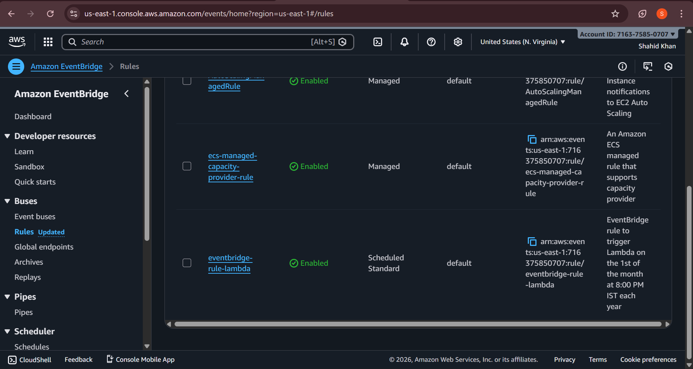
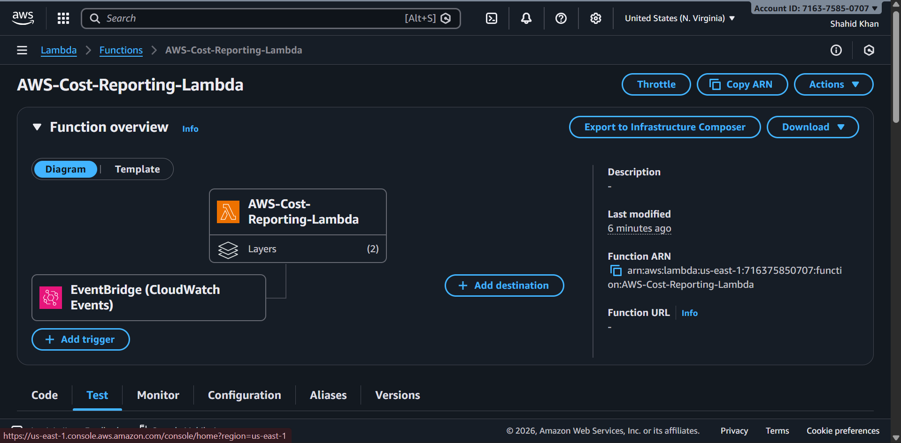

# AWS Cost Reporting

An automated AWS cost tracking and reporting solution that leverages AWS Lambda, EventBridge, and SES to deliver daily cost reports via email.

## Overview

This Terraform infrastructure deploys an automated cost reporting system that:
- Retrieves AWS billing data daily using the AWS Cost Explorer API
- Generates detailed cost reports with breakdowns by service
- Sends email notifications with cost summaries
- Runs on a scheduled basis using EventBridge

## Architecture


The solution consists of:

### Components

**EventBridge Rule**

- Triggers Lambda function on a daily schedule
- Routes cost reporting events to the Lambda processor

**Lambda Function**

- Executes Python code to fetch cost data from AWS Cost Explorer
- Processes and formats billing information
- Sends reports via AWS SES

## Prerequisites

- AWS Account with appropriate permissions
- Terraform installed (v1.0+)
- AWS CLI configured with credentials
- An email address verified in AWS SES (for sending reports)

## Deployment

### 1. Configure Variables

Update `terraform.tfvars` with your AWS credentials:

```hcl
aws_access_key = "YOUR_ACCESS_KEY"
aws_secret_key = "YOUR_SECRET_KEY"
aws_region     = "us-east-1"
```

### 2. Initialize Terraform

```bash
terraform init
```

### 3. Review and Apply

```bash
terraform plan
terraform apply
```

## Configuration

### Key Files

- **lambda-function.tf** - Lambda function definition
- **lambda-layers.tf** - Python dependencies layer
- **eventbridge-rule.tf** - Scheduled trigger configuration
- **iam-role.tf & policy.tf** - IAM permissions
- **providers.tf** - AWS provider setup
- **variables.tf** - Input variable definitions

### Environment Variables

The Lambda function reads:
- Daily cost data from AWS Cost Explorer
- AWS region from Terraform variables

## Email Setup

### Verify Email Address

Before the Lambda can send emails, verify your email address in AWS SES:

1. Go to AWS Console → Simple Email Service (SES)
2. Navigate to **Verified identities**
3. Click **Create identity**
4. Select **Email address**
5. Enter your email address
6. Check your inbox for verification email
7. Click the verification link

### Production Access

To send from any email address (exit sandbox mode):
- Submit SES Sending Limits Increase request in AWS Console
- AWS reviews and typically approves within 24 hours

## Lambda Output

The Lambda function generates reports like:

| Service | Cost |
|---------|------|
| EC2 | $45.32 |
| S3 | $12.15 |
| RDS | $28.50 |
| **Total** | **$86.97** |

Example output is stored in `assets/lambda output`

## Features

✅ **Automated Scheduling** - Daily cost reports via EventBridge  
✅ **Cost Breakdown** - Service-level cost analysis  
✅ **Email Notifications** - Direct delivery to your inbox  
✅ **Infrastructure as Code** - Reproducible Terraform deployment  
✅ **Secure** - IAM roles with least-privilege access  
✅ **Monitorable** - CloudWatch Logs integration  

## Troubleshooting

### Email Not Sending

**Error:** "Email address is not verified"
- Solution: Verify the sender email in AWS SES (see Email Setup above)

### Lambda Handler Not Found

**Error:** "Handler 'lambda_handler' missing on module 'python-code'"
- Solution: Ensure `python-code.zip` is created correctly with Python files at the root level

### Cost Data Not Retrieving

**Error:** Access denied to Cost Explorer API
- Solution: Verify the IAM role has `ce:GetCostAndUsage` permissions

## Costs

This solution is generally low-cost:
- **Lambda**: ~$0.20/month (daily invocations)
- **SES**: Free for verified emails (up to 200/day)
- **CloudWatch**: Minimal logs storage
- **Total**: < $1/month typically

## Security Considerations

- Store AWS credentials in environment variables or AWS credentials file (not in `terraform.tfvars`)
- Restrict Lambda IAM role to only required permissions
- Enable CloudTrail logging for audit trails
- Consider rotating credentials regularly

## License

[Add your license information]

## Support

For issues or questions:
1. Check CloudWatch Logs for Lambda execution details
2. Review IAM permissions in policy.tf
3. Verify AWS SES email configuration

---

**Last Updated:** January 2026  
**AWS Region:** us-east-1 (configurable)
