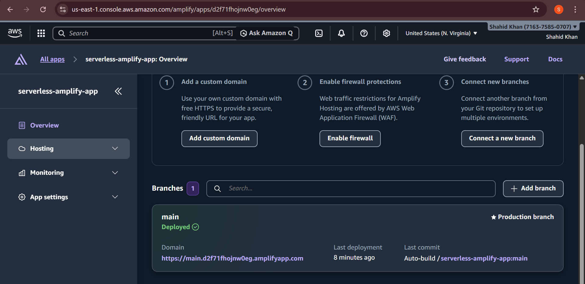
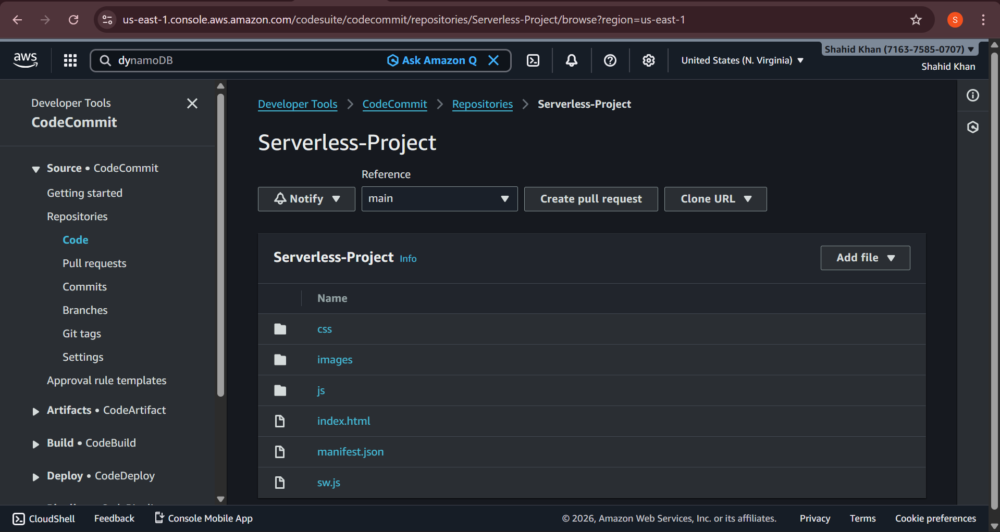
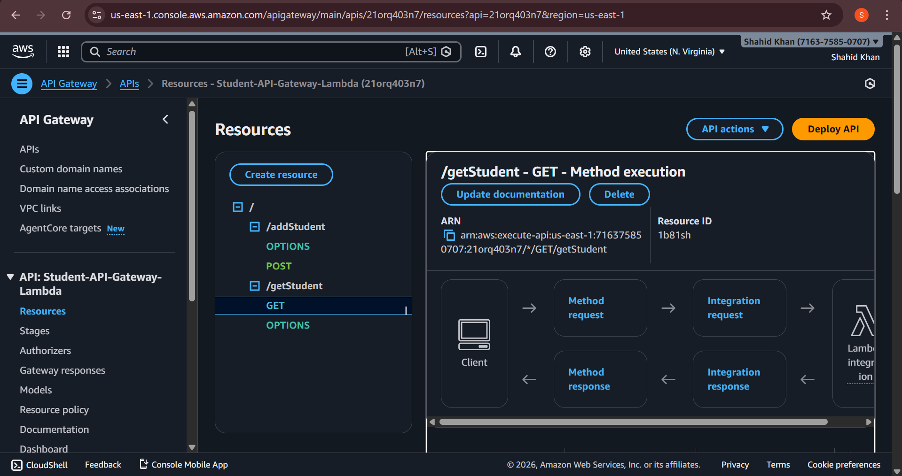
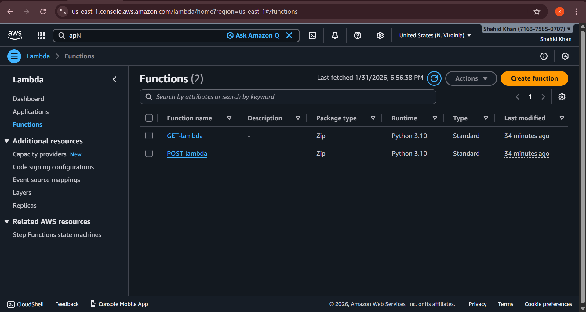
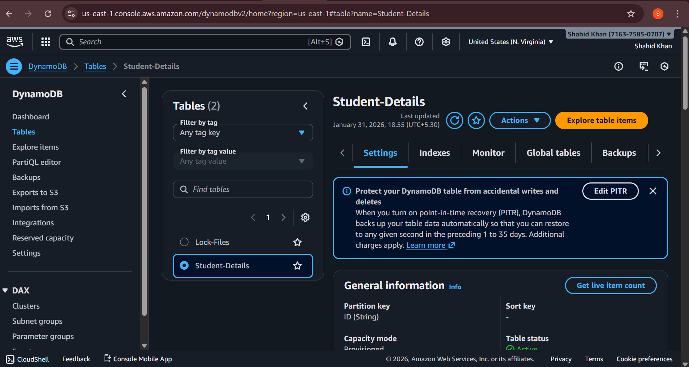

# AWS Serverless Application - Student Management System


A fully serverless student management system built on AWS using Terraform Infrastructure as Code. This project demonstrates a complete serverless architecture with Lambda functions, API Gateway, DynamoDB, and AWS Amplify for frontend hosting.

## 🏗️ Architecture Overview

This application implements a modern serverless architecture with the following components:

- **Frontend**: AWS Amplify (Static Website Hosting)
- **API Layer**: Amazon API Gateway (REST API)
- **Compute**: AWS Lambda (Serverless Functions)
- **Database**: Amazon DynamoDB (NoSQL Database)
- **Storage**: Amazon S3 (Lambda Code Storage)
- **CDN**: Amazon CloudFront (Content Delivery)
- **DNS**: Amazon Route53 (Domain Management)
- **Security**: AWS Certificate Manager (SSL/TLS)
- **Version Control**: AWS CodeCommit (Git Repository)
- **Monitoring**: Amazon CloudWatch (Logs & Metrics)

## 📋 Table of Contents

- [Features](#features)
- [Architecture Components](#architecture-components)
- [Prerequisites](#prerequisites)
- [Project Structure](#project-structure)
- [Getting Started](#getting-started)
- [Deployment](#deployment)
- [API Endpoints](#api-endpoints)
- [Infrastructure Details](#infrastructure-details)
- [Outputs](#outputs)
- [Cleanup](#cleanup)
- [Best Practices](#best-practices)

## ✨ Features

- ✅ **Fully Serverless**: No server management required
- ✅ **Infrastructure as Code**: Complete Terraform configuration
- ✅ **Auto-Scaling**: Automatically scales with traffic
- ✅ **CORS Enabled**: Cross-Origin Resource Sharing configured
- ✅ **Custom Domain**: SSL/TLS with custom domain support
- ✅ **CI/CD Ready**: Amplify auto-build from CodeCommit
- ✅ **Secure**: IAM roles and policies with least privilege
- ✅ **Cost-Effective**: Pay only for what you use
- ✅ **High Availability**: Multi-AZ deployment

## 🔧 Architecture Components

### 1. AWS Amplify


**Purpose**: Hosts the static frontend website with automatic builds from CodeCommit.

**Configuration**:
- Auto-build enabled on main branch commits
- Custom domain with CloudFront CDN
- Build specification for static assets

### 2. AWS CodeCommit


**Purpose**: Git-based version control for application code.

**Repository**: `Serverless-Project`
- Main branch: Production deployments
- Triggers Amplify builds on push

### 3. Amazon API Gateway


**Purpose**: RESTful API endpoints for Lambda function invocation.

**Endpoints**:
- `POST /addStudent` - Add new student
- `GET /getStudent` - Retrieve all students
- `OPTIONS` - CORS preflight requests

**Stage**: Production (`Prod`)

### 4. AWS Lambda


**Purpose**: Serverless compute for business logic.

**Functions**:
1. **GET-lambda**: Retrieves students from DynamoDB
2. **POST-lambda**: Adds students to DynamoDB

**Runtime**: Python 3.10
**Memory**: 128 MB
**Timeout**: 60 seconds

### 5. Amazon DynamoDB


**Purpose**: NoSQL database for storing student records.

**Table**: `Student-Details`
- **Partition Key**: ID (String)
- **Attributes**: Name, Email, Course, CreatedAt
- **Read/Write Capacity**: 10 units each

### 6. Amazon S3


**Purpose**: Stores Lambda deployment packages.

**Bucket**: `lambda-backend-code-25468`
- Versioning enabled
- Server-side encryption (AES256)
- Contains: GET.zip, POST.zip

## 📦 Prerequisites

- **Terraform**: >= 0.13.0
- **AWS CLI**: Configured with credentials
- **AWS Account**: With appropriate permissions
- **Git**: For CodeCommit repository
- **Python**: 3.10 (for Lambda development)
- **Domain**: Registered domain (optional for custom domain)

## 📁 Project Structure

```
AWS-Serverless/
├── amplify_app.tf              # Amplify app and branch configuration
├── amplify-outputs.tf          # Amplify outputs and build trigger
├── api-gateway.tf              # API Gateway REST API configuration
├── backend.tf                  # Terraform backend (S3 state)
├── cloudfront-acm-route53.tf   # CDN, SSL, and DNS configuration
├── cloudwatch-logs.tf          # Log groups for Lambda functions
├── dynamodb.tf                 # DynamoDB table configuration
├── enable-cors-apigw.tf        # CORS configuration for API
├── iam-policy.tf               # IAM policies for services
├── iam-roles.tf                # IAM roles for Lambda and Amplify
├── lambda.tf                   # Lambda function definitions
├── lambda-permissions.tf       # API Gateway invoke permissions
├── providers.tf                # AWS provider configuration
├── s3-bucket.tf                # S3 bucket for Lambda code
├── terraform.tfvars            # Variable values (DO NOT COMMIT)
├── variables.tf                # Variable declarations
├── lambda-code/                # Lambda function source code
│   ├── GETmethod.py           # GET Lambda handler
│   ├── POSTmethod.py          # POST Lambda handler
│   └── README.md              # Lambda documentation
└── assets/                     # Documentation images
    ├── amplify.png
    ├── api-gateway.png
    ├── codecommit.png
    ├── dynamodb.png
    ├── lambda.png
    ├── s3.png
    ├── output.png
    └── Serverless.gif
```

## 🚀 Getting Started

### Step 1: Clone the Repository

```bash
git clone https://git-codecommit.us-east-1.amazonaws.com/v1/repos/Serverless-Project
cd Serverless-Project
```

### Step 2: Configure Variables

Update `terraform.tfvars` with your values:

```hcl
aws_access_key      = "YOUR_ACCESS_KEY"
aws_secret_key      = "YOUR_SECRET_KEY"
aws_region          = "us-east-1"
app_name            = "serverless-amplify-app"
app_repo            = "https://git-codecommit.us-east-1.amazonaws.com/v1/repos/Serverless-Project"
app_branch          = "main"
app_domain_name     = "yourdomain.com"
db_table_name       = "Student-Details"
bucket_name         = "your-unique-bucket-name"
```

**⚠️ Security Note**: Never commit `terraform.tfvars` to version control. Add it to `.gitignore`.

### Step 3: Prepare Lambda Functions

Package Lambda functions:

```bash
cd lambda-code
zip GET.zip GETmethod.py
zip POST.zip POSTmethod.py
```

Upload to S3:

```bash
aws s3 cp GET.zip s3://your-bucket-name/GET.zip
aws s3 cp POST.zip s3://your-bucket-name/POST.zip
```

### Step 4: Initialize Terraform

```bash
terraform init
```

## 🎯 Deployment

### Deploy Infrastructure

```bash
# Review the plan
terraform plan

# Apply changes
terraform apply

# Confirm with 'yes'
```

### Deployment Stages

1. **S3 Bucket**: Creates bucket for Lambda code
2. **DynamoDB Table**: Creates database table
3. **IAM Roles & Policies**: Sets up permissions
4. **Lambda Functions**: Deploys serverless functions
5. **API Gateway**: Creates REST API endpoints
6. **CloudWatch Logs**: Sets up log groups
7. **Amplify App**: Configures frontend hosting
8. **CloudFront & Route53**: Sets up CDN and DNS
9. **ACM Certificate**: Provisions SSL certificate
10. **Build Trigger**: Initiates Amplify build

### Verify Deployment

After successful deployment, check:

```bash
# Get Amplify URL
terraform output amplify_app_url

# Test API Gateway
curl https://YOUR_API_ID.execute-api.us-east-1.amazonaws.com/Prod/getStudent
```

## 📡 API Endpoints

### Base URL
```
https://YOUR_API_ID.execute-api.us-east-1.amazonaws.com/Prod
```

### Endpoints

#### Add Student (POST)
```bash
POST /addStudent

# Request Body
{
  "name": "John Doe",
  "email": "john@example.com",
  "course": "Computer Science"
}

# Response
{
  "message": "Student added successfully",
  "id": "uuid-here",
  "timestamp": "2026-01-31T12:00:00.000Z"
}
```

#### Get Students (GET)
```bash
GET /getStudent

# Response
[
  {
    "ID": "uuid-1",
    "Name": "John Doe",
    "Email": "john@example.com",
    "Course": "Computer Science",
    "CreatedAt": "2026-01-31T12:00:00.000Z"
  }
]
```

## 🏛️ Infrastructure Details

### Lambda Functions

**GET Lambda** (`GETmethod.py`):
- Scans DynamoDB table
- Returns all student records
- Includes CORS headers

**POST Lambda** (`POSTmethod.py`):
- Validates input fields
- Generates unique ID
- Adds timestamp
- Inserts into DynamoDB

### IAM Policies

**Lambda Policy**:
- CloudWatch Logs: CreateLogGroup, CreateLogStream, PutLogEvents
- DynamoDB: PutItem, GetItem, Scan, Query, UpdateItem, DeleteItem

**Amplify Policy**:
- CloudWatch Logs: CreateLogGroup, CreateLogStream, PutLogEvents
- CodeCommit: GitPull, GetBranch, GetCommit, GetRepository, ListBranches

### Security

- **Scoped IAM Policies**: Least privilege access
- **SSL/TLS**: Enforced via CloudFront and ACM
- **CORS**: Configured for allowed origins
- **Encryption**: S3 server-side encryption enabled
- **State Locking**: DynamoDB table for Terraform state

## 📊 Outputs


After deployment, Terraform provides:

```bash
terraform output
```

Expected outputs:
- `amplify_app_id`: Amplify application ID
- `amplify_default_domain`: Default Amplify domain
- `amplify_app_url`: Full Amplify URL

## 🧹 Cleanup

To destroy all resources:

```bash
# Destroy infrastructure
terraform destroy

# Confirm with 'yes'
```

**⚠️ Warning**: This will delete:
- All Lambda functions
- DynamoDB table and data
- S3 bucket (if empty)
- Amplify app
- CloudFront distribution
- API Gateway
- All associated resources

## 📚 Best Practices

### Security
- ✅ Use AWS Secrets Manager for sensitive data
- ✅ Enable CloudTrail for audit logging
- ✅ Implement API Gateway throttling
- ✅ Use VPC endpoints for private access
- ✅ Enable MFA for AWS accounts

### Cost Optimization
- ✅ Use DynamoDB on-demand pricing for variable workloads
- ✅ Set appropriate Lambda memory and timeout
- ✅ Enable CloudFront compression
- ✅ Implement S3 lifecycle policies
- ✅ Monitor with AWS Cost Explorer

### Performance
- ✅ Use CloudFront for global content delivery
- ✅ Enable DynamoDB DAX for caching
- ✅ Optimize Lambda cold starts
- ✅ Use API Gateway caching
- ✅ Implement database indexes

### Monitoring
- ✅ Set up CloudWatch Alarms
- ✅ Enable X-Ray tracing
- ✅ Monitor Lambda metrics
- ✅ Track API Gateway latency
- ✅ Set up SNS notifications

## 🔄 CI/CD Pipeline

The application supports continuous deployment:

1. **Code Push**: Push to CodeCommit main branch
2. **Amplify Trigger**: Auto-build triggered
3. **Build Phase**: Static assets prepared
4. **Deploy Phase**: Published to Amplify hosting
5. **CloudFront**: Content distributed globally

## 🐛 Troubleshooting

### Issue: Amplify build fails
**Solution**: Check build logs in Amplify console and verify `amplify.yml`

### Issue: Lambda timeout
**Solution**: Increase timeout in `terraform.tfvars` or optimize function code

### Issue: CORS errors
**Solution**: Verify OPTIONS method configuration in `enable-cors-apigw.tf`

### Issue: DynamoDB throttling
**Solution**: Increase read/write capacity or switch to on-demand

### Issue: CloudFront 404 errors
**Solution**: Verify origin domain points to correct Amplify branch URL

## 📞 Support

For issues or questions:
- Check AWS CloudWatch Logs
- Review Terraform plan output
- Verify IAM permissions
- Test API endpoints directly

## 📝 License

This project is provided as-is for educational and demonstration purposes.

## 🙏 Acknowledgments

- AWS Documentation
- Terraform AWS Provider
- AWS Serverless Application Model

---

**Built with ❤️ using AWS Serverless Technologies and Terraform**
