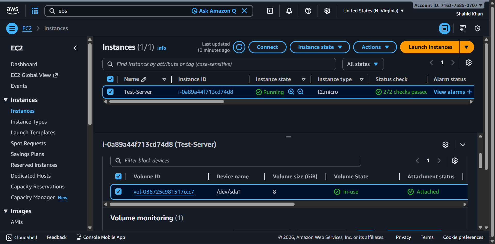
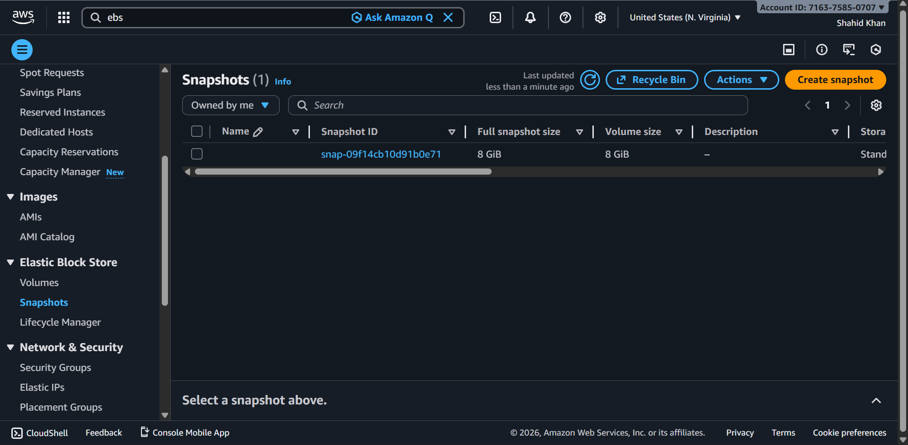

# EBS Snapshot Cost Optimization

An automated AWS solution for optimizing EBS snapshot costs using Lambda functions, IAM policies, and event-driven architecture.

## Overview

This project implements a cost optimization system that automatically manages and analyzes EBS snapshots to reduce storage costs in AWS. It uses AWS Lambda to process snapshot data and generate cost reports through SNS notifications.

## Architecture


### Components

- **EC2 Instances with EBS Volumes**
  
  
  
  The infrastructure runs on EC2 instances with attached EBS volumes that are regularly snapshotted.

- **EBS Snapshots**
  
  
  
  Automated snapshots of EBS volumes used for backup and disaster recovery.

## Technology Stack

- **Infrastructure as Code**: Terraform
- **Compute**: AWS Lambda (Python 3.10)
- **Storage**: AWS S3, EBS Snapshots
- **Messaging**: Amazon SNS
- **Identity & Access**: AWS IAM
- **Backend State**: AWS S3 with DynamoDB locking

## Project Structure

```
.
├── lambda.tf              # Lambda function definition
├── iam-role.tf           # IAM role for Lambda
├── iam-policy.tf         # IAM policy definitions
├── s3-bucket.tf          # S3 bucket for state/artifacts
├── sns-topic.tf          # SNS topic for cost reports
├── providers.tf          # AWS provider configuration
├── backend.tf            # Terraform state backend
├── variables.tf          # Input variables
├── terraform.tfvars      # Variable values
├── lambda_role.json      # IAM role policy document
├── lambda_policy.json    # Lambda execution policy
└── assets/               # Documentation assets
    ├── AWS-Infra-Diagram.gif
    ├── ec2.png
    └── snapshot.png
```

## Prerequisites

- AWS Account with appropriate permissions
- Terraform >= 1.0
- Python 3.10
- AWS CLI configured with credentials

## Features

- **Automated Snapshot Analysis**: Lambda function analyzes EBS snapshots in your AWS account
- **Cost Reporting**: Generates cost reports and sends them via SNS
- **Scalable Architecture**: Event-driven design that scales automatically
- **Infrastructure as Code**: Fully deployable with Terraform
- **Secure**: IAM policies follow the principle of least privilege

## Deployment

1. **Initialize Terraform**:
   ```bash
   terraform init
   ```

2. **Review the Plan**:
   ```bash
   terraform plan
   ```

3. **Apply Configuration**:
   ```bash
   terraform apply
   ```

4. **Destroy Resources** (when no longer needed):
   ```bash
   terraform destroy
   ```

## Configuration

Update `terraform.tfvars` to customize:
- Lambda function name
- Memory allocation
- Timeout duration
- SNS topic name
- S3 bucket names

## Lambda Function

The Lambda function (`ebs_snapshot_cost_optimization.zip`) includes:
- EBS snapshot enumeration
- Cost calculation based on storage size
- Cost report generation
- SNS notification sending

## IAM Permissions

The IAM policy grants the Lambda function permissions to:
- Describe EBS snapshots
- Read from S3 buckets
- Publish to SNS topics
- Write CloudWatch logs

## Cost Optimization Benefits

✓ Automated snapshot lifecycle management  
✓ Identify unused or redundant snapshots  
✓ Reduce storage costs  
✓ Generate cost awareness reports  
✓ Schedule automated cleanup tasks  

## Monitoring

CloudWatch logs are automatically created for the Lambda function. Monitor:
- Execution duration
- Error rates
- Memory usage
- Cost calculations

## Support & Contribution

For issues or improvements, please review the Terraform configuration and Lambda code.

## License

This project is provided as-is for AWS cost optimization purposes.
