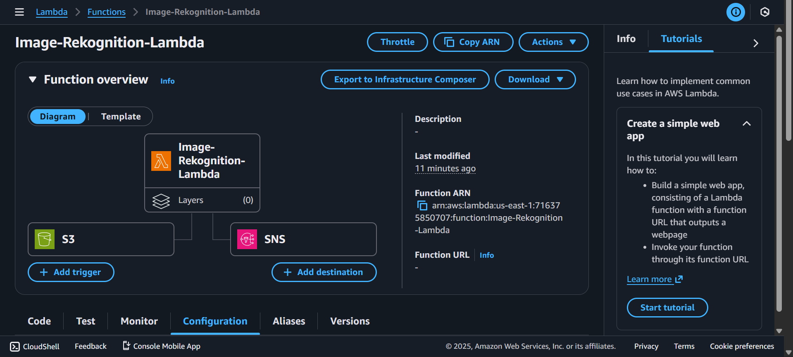
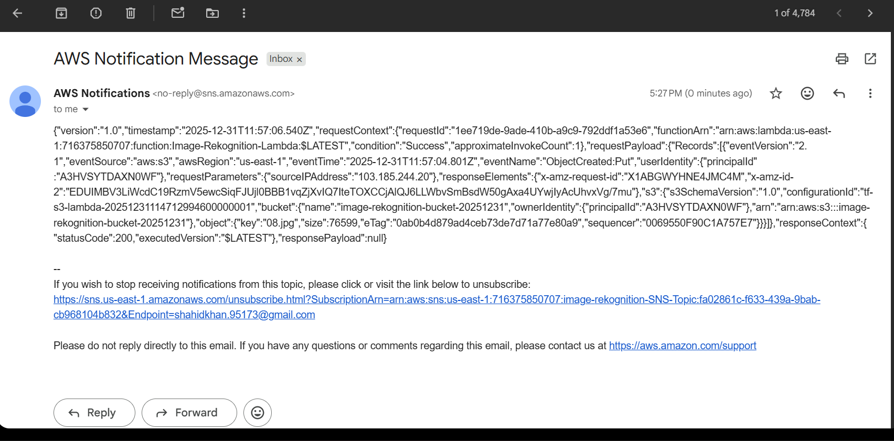

# Intelligent Image Recognition System with AWS

An automated serverless image recognition system built on AWS that analyzes images using Amazon Rekognition and sends notifications via email.

## Architecture Overview

```
S3 Bucket (Image Upload)
    ↓
    └→ Triggers Lambda Function
         ↓
         └→ Amazon Rekognition (Image Analysis)
              ↓
              └→ SNS Topic (Email Notification)
                   ↓
                   └→ User Email
```

### Architecture Diagram






## System Components

### 1. **Amazon S3 Bucket**
- **Purpose**: Store images for analysis
- **Configuration**: Automatic event notifications to Lambda
- **Trigger Event**: `s3:ObjectCreated:*` (any object upload)
- **Bucket Name**: `image-rekognition-bucket-20251231`

### 2. **AWS Lambda Function**
- **Name**: `Image-Rekognition-Lambda`
- **Runtime**: Python 3.9
- **Memory**: 128 MB
- **Timeout**: 10 seconds
- **Handler**: `ImageRekognition.lambda_handler`
- **Role**: IAM role with Rekognition permissions

**Environment Variables:**
- `BUCKET_NAME`: S3 bucket name for image storage
- `SNS_TOPIC_ARN`: SNS topic ARN for email notifications

### 3. **Amazon Rekognition**
Analyzes uploaded images and detects:
- Objects and scenes
- Faces and facial features
- Text in images
- Labels and tags
- Image properties

### 4. **Amazon SNS (Simple Notification Service)**
- **Topic Name**: `image-rekognition-SNS-Topic`
- **Protocol**: Email
- **Subscriber**: `shahidkhan.95173@gmail.com`

### 5. **IAM Role & Permissions**
Grants Lambda function access to:
- S3 bucket read operations
- Rekognition analysis
- SNS topic publishing
- CloudWatch Logs

## Infrastructure as Code (Terraform)

All AWS resources are defined using Terraform for easy deployment and management.

### Files Structure
```
├── backend.tf                 # S3 backend & state locking config
├── providers.tf              # AWS provider configuration
├── variables.tf              # Variable definitions
├── s3-bucket.tf              # S3 bucket resource
├── lambda-function.tf        # Lambda function & triggers
├── sns-topic.tf              # SNS topic & subscriptions
├── iam-roles.tf              # IAM role definitions
├── iam-role.json             # IAM assume role policy
├── iam-policy.json           # IAM permissions policy
├── iam-policy.tf             # IAM policy attachment
├── ImageRekognition.zip      # Lambda function code
├── terraform.tfvars          # Variable values (sensitive)
└── assets/                   # Documentation images
```

## Deployment Instructions

### Prerequisites
- AWS CLI configured with credentials
- Terraform installed (v0.13+)
- S3 bucket for Terraform state (`my-ews-baket1`)
- DynamoDB table for state locking (`Lock-Files`)
- Python 3.9 Lambda code packaged as `ImageRekognition.zip`

### Steps

1. **Initialize Terraform**
   ```powershell
   terraform init
   ```

2. **Review Infrastructure Plan**
   ```powershell
   terraform plan
   ```

3. **Deploy Infrastructure**
   ```powershell
   terraform apply
   ```

4. **Confirm SNS Email Subscription**
   - Check your email inbox for SNS confirmation
   - Click the confirmation link to activate notifications

## Usage

### 1. Upload an Image
Upload an image to the S3 bucket:
```powershell
aws s3 cp path/to/image.jpg s3://image-rekognition-bucket-20251231/
```

### 2. Automatic Processing
- S3 event triggers Lambda function automatically
- Lambda calls Amazon Rekognition to analyze the image
- SNS publishes notification email with results

### 3. Receive Email Notification
The Lambda function sends detailed analysis results via email including:
- Detected objects and labels
- Confidence scores
- Additional image properties

## Monitoring & Logs

### View Lambda Logs
```powershell
aws logs tail /aws/lambda/Image-Rekognition-Lambda --follow
```

### Check S3 Events
```powershell
aws s3api get-bucket-notification-configuration --bucket image-rekognition-bucket-20251231
```

### Monitor SNS
```powershell
aws sns list-subscriptions-by-topic --topic-arn arn:aws:sns:us-east-1:716375850707:image-rekognition-SNS-Topic
```

## Security Features

✅ **Encrypted State Management**
- Terraform state stored in S3 with encryption enabled
- DynamoDB table for state locking

✅ **Credentials Management**
- AWS credentials stored in `terraform.tfvars` (added to `.gitignore`)
- Sensitive variables marked in Terraform
- IAM role-based access control

✅ **Bucket Security**
- S3 bucket is private (not public)
- Versioning enabled for state files
- Encryption enabled for state storage

✅ **IAM Permissions**
- Least privilege principle applied
- Lambda role has minimal required permissions
- Separate policies for each AWS service

## Cost Optimization

- **Lambda**: Free tier covers 1M requests/month
- **S3**: Pay per GB stored and transferred
- **Rekognition**: Pay per image analyzed (~$1-2 per 1000 images)
- **SNS**: Free tier covers 1000 email notifications/month

## Troubleshooting

### Issue: Terraform Init Fails
**Solution**: Verify S3 bucket exists and DynamoDB table is created
```powershell
aws s3 ls
aws dynamodb list-tables
```

### Issue: Lambda Not Triggered
**Solution**: Check S3 bucket notification configuration
```powershell
aws s3api get-bucket-notification-configuration --bucket image-rekognition-bucket-20251231
```

### Issue: No Email Received
**Solution**: Confirm SNS subscription
1. Check email inbox/spam
2. Verify subscription in SNS console
3. Check Lambda execution logs

## Cleanup

To destroy all AWS resources:
```powershell
terraform destroy
```

**Warning**: This will delete:
- S3 bucket and all stored images
- Lambda function
- SNS topic
- IAM roles and policies

## Variables

Configure these in `terraform.tfvars`:

| Variable | Default | Description |
|----------|---------|-------------|
| `aws_access_key` | - | AWS Access Key ID (sensitive) |
| `aws_secret_key` | - | AWS Secret Access Key (sensitive) |
| `aws_region` | us-east-1 | AWS Region |
| `s3-bucket-lambda-code` | image-rekognition-bucket-20251231 | S3 bucket name |
| `lambda-function-name` | Image-Rekognition-Lambda | Lambda function name |
| `sns-name` | image-rekognition-SNS-Topic | SNS topic name |
| `mail-id` | shahidkhan.95173@gmail.com | Email for notifications |

## Technologies Used

- **AWS Services**: S3, Lambda, Rekognition, SNS, IAM, CloudWatch
- **Infrastructure as Code**: Terraform
- **Runtime**: Python 3.9
- **Configuration Management**: Terraform tfvars
- **State Management**: S3 + DynamoDB

## License

This project is provided as-is for educational purposes.

## Support

For issues or questions:
1. Check Lambda logs: `aws logs tail /aws/lambda/Image-Rekognition-Lambda`
2. Review Terraform state: `terraform show`
3. Verify AWS credentials: `aws configure list`

---

**Last Updated**: December 31, 2025
**Project Status**: ✅ Deployed and Operational
