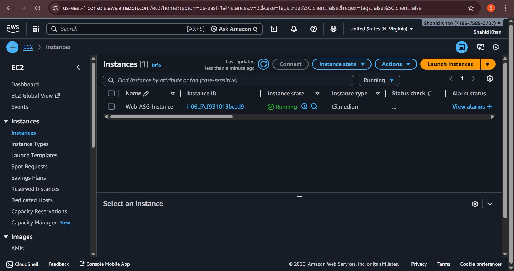
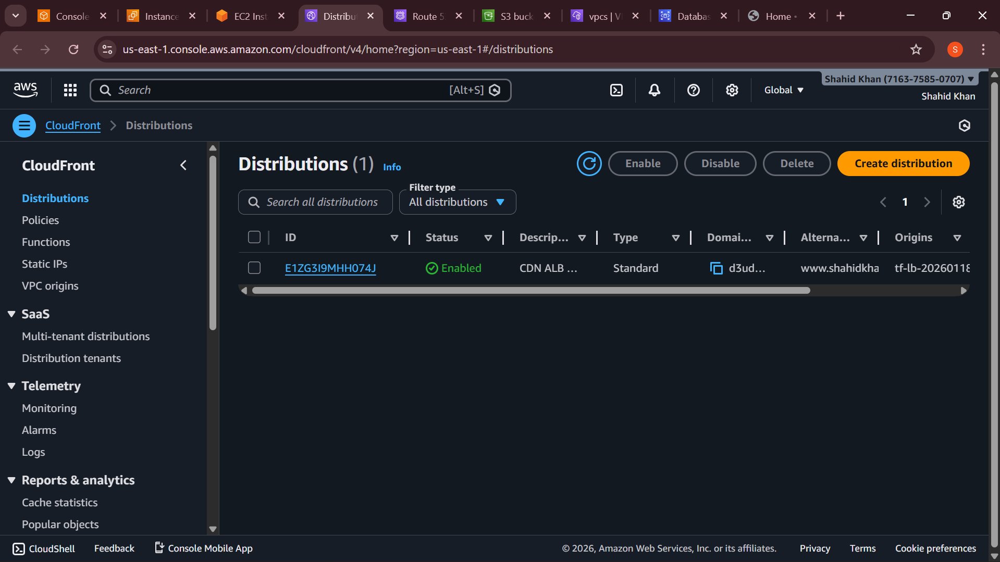
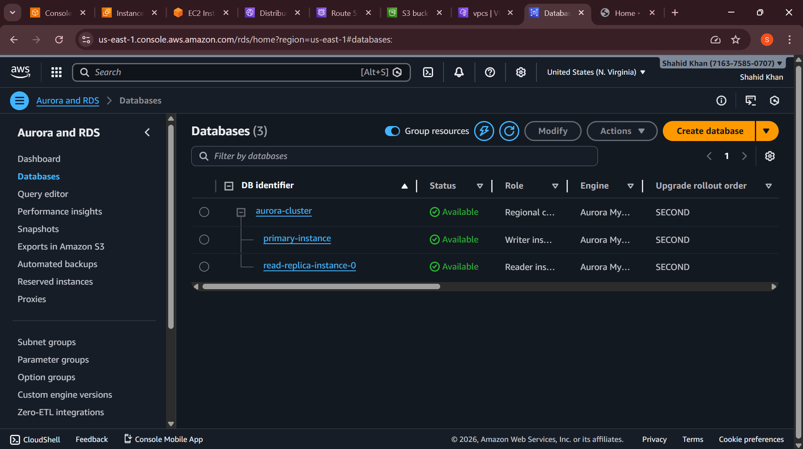
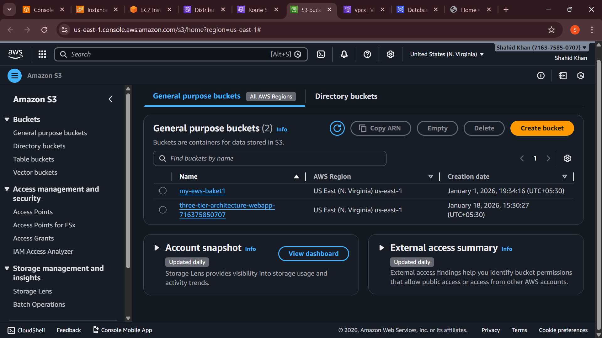
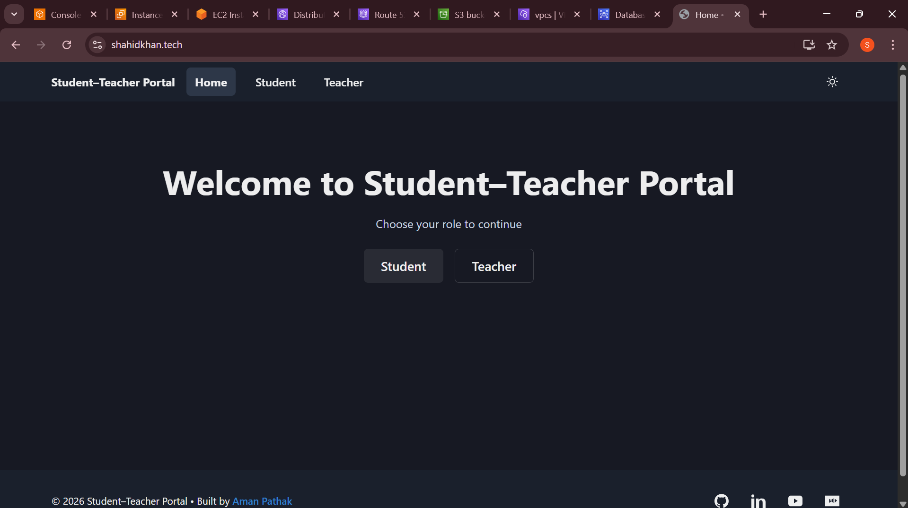

# Three-Tier Architecture on AWS (Terraform)


## Overview
This project provisions a production-style three-tier web application on AWS using Terraform. It deploys a public web tier, private app tier, and private database tier with high availability across two AZs.

## AWS Components
- Networking: VPC, 2 public + 4 private subnets, dual NAT Gateways, route tables
- Security: ALB SGs, tier-specific SGs, WAF (Web ACL), ACM certificate, Route 53 records
- Web Tier: Public ALB -> Web ASG (t3.medium, Ubuntu 22.04) serving React via Nginx
- App Tier: Internal ALB -> App ASG (t3.medium) running Node.js backend via PM2
- Database: Aurora MySQL cluster (primary + read replica) in private subnets
- Edge & Storage: CloudFront in front of Web ALB, S3 bucket for static assets

## Architecture Flow
1. User -> CloudFront (+WAF) -> Web ALB (HTTP/80)
2. Web ALB -> Web EC2 (Nginx serves React; proxies /api to App ALB:3500)
3. App ALB (3500) -> App EC2 (Node.js API via PM2)
4. App EC2 -> Aurora MySQL (3306) in private DB subnets

## Prerequisites
- Terraform >= 1.6
- AWS credentials with permissions for VPC/EC2/ALB/RDS/CloudFront/Route53/WAF/ACM
- An existing Route 53 hosted zone for your domain
- (Optional) EC2 key pair name for SSH: set `key-name` in `terraform.tfvars`

## Key Files
- Networking: `vpc.tf`, `autoscaling.tf`, `elb.tf`, `security-group.tf`
- Compute: `launch_configuration.tf`, `user_data_web.tpl`, `user_data_app.tpl`
- Database: `rds.tf`
- Edge & DNS: `cloudfront.tf`, `route53.tf`, `waf.tf`, `certificate-manager.tf`
- Buckets: `s3-bucket.tf`
- Outputs: `outputs.tf`
- Variables: `variables.tf`, `terraform.tfvars`

## Diagrams & Views
- Web stack: 
- App stack: 
- Database: 
- Storage: 
- Sample outputs: 

## How to Deploy
```bash
terraform init
terraform plan -out=tfplan
terraform apply tfplan
```

## Configure Inputs
Edit `terraform.tfvars`:
- `aws_access_key`, `aws_secret_key`, `aws_region`
- `key-name` (optional, EC2 key pair for SSH)
- Domain settings in Route 53 if using custom domain/ACM

## Post-Deploy
- Get endpoints: `terraform output`
- Test Web ALB URL and CloudFront domain
- Verify target health in both target groups

## SSH Access (optional)
- Web tier has public IP; App tier is private (use SSM or jump from Web)
- Opened port 22 in SGs; restrict CIDR for production

## Notes
- Allow 5–10 minutes for instances to install dependencies and pass health checks
- Costs include ALBs, NAT Gateways, EC2, Aurora, CloudFront, WAF
