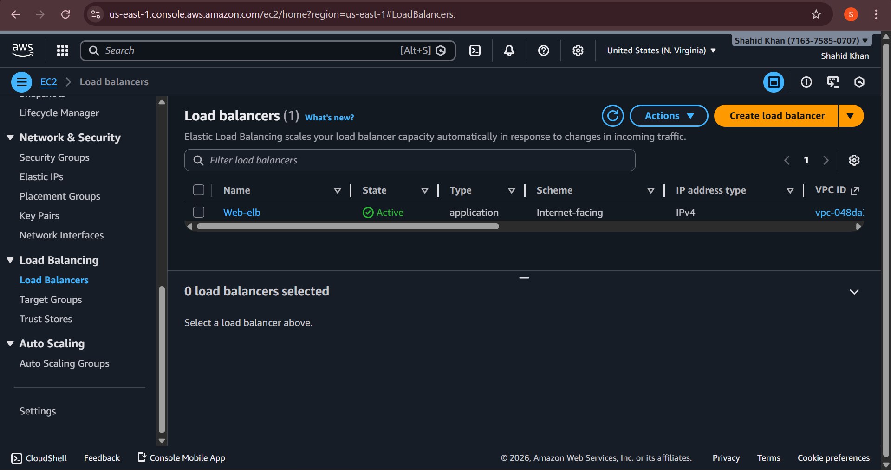
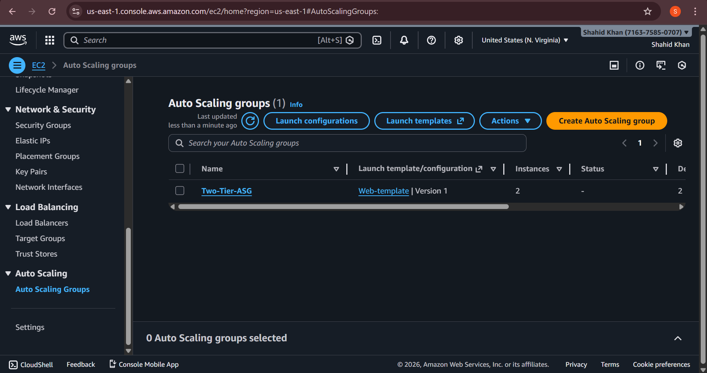
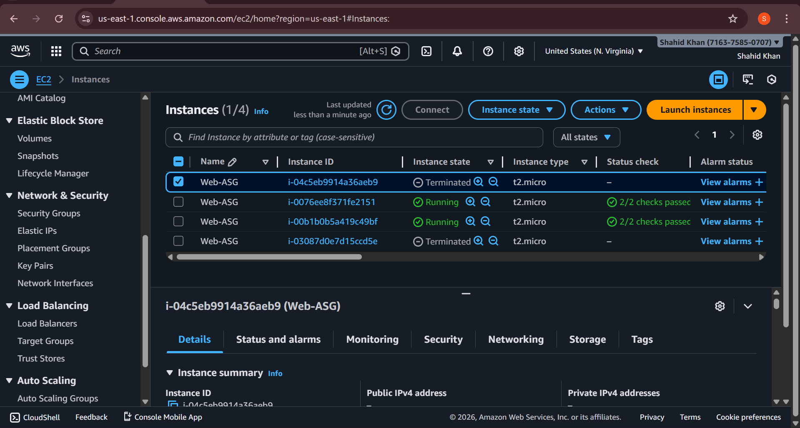
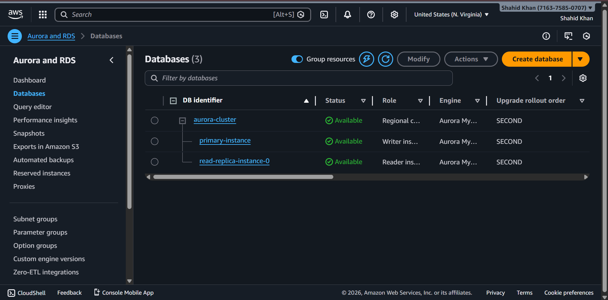
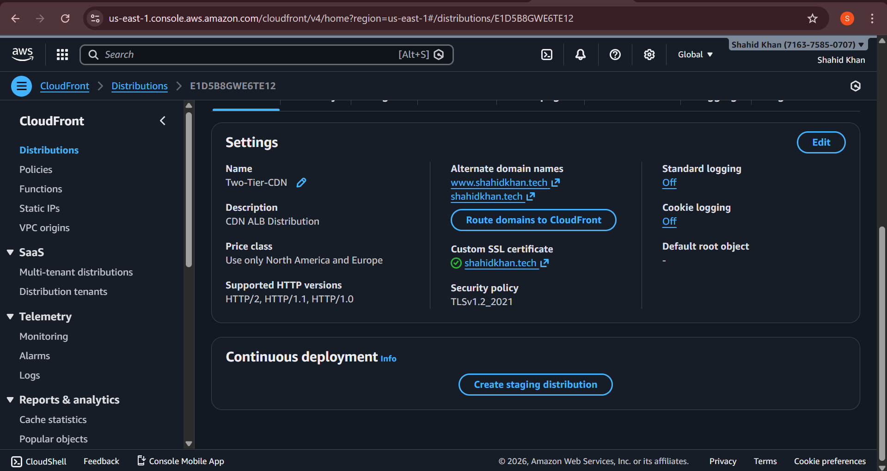
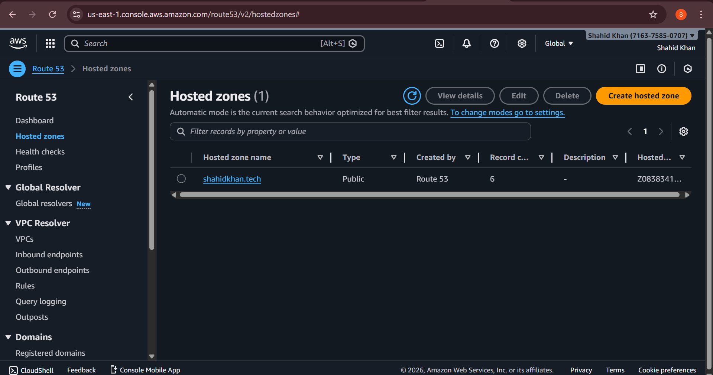
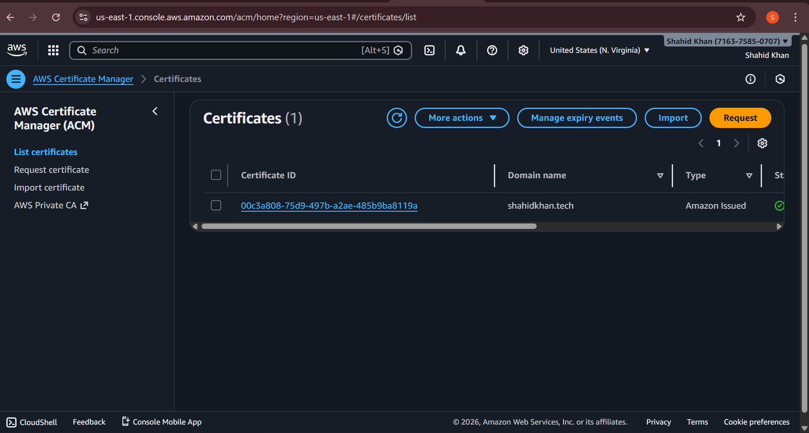
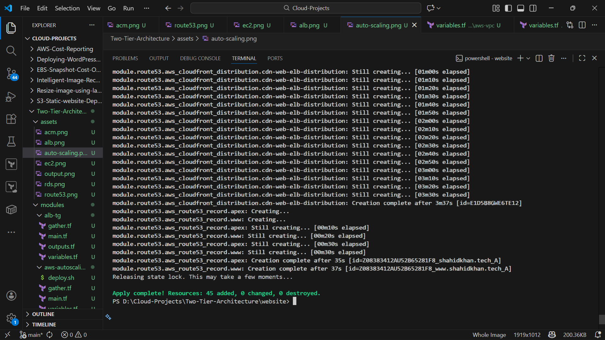

# Two-Tier Architecture on AWS

A production-ready, modularized Terraform configuration for deploying a highly available, scalable two-tier application architecture on Amazon Web Services (AWS).

## 📋 Table of Contents

- [Architecture Overview](#architecture-overview)
- [Features](#features)
- [Project Structure](#project-structure)
- [Prerequisites](#prerequisites)
- [Installation & Setup](#installation--setup)
- [Configuration](#configuration)
- [Deployment](#deployment)
- [Module Details](#module-details)
- [Cleanup](#cleanup)

---

## 🏗️ Architecture Overview


This solution implements a highly available, scalable two-tier application architecture with the following components:

### **Components:**

1. **VPC & Networking** - Isolated VPC with public and private subnets across 2 availability zones
2. **Web Tier** - EC2 instances managed by Auto Scaling Group behind Application Load Balancer
3. **Database Tier** - Aurora MySQL RDS cluster with read replicas in private subnets
4. **Security** - Security groups, IAM roles, and WAF protection
5. **CDN & DNS** - CloudFront distribution with Route53 and ACM certificates
6. **Monitoring** - CloudWatch alarms for auto-scaling policies

### **Key Features:**

- ✅ **High Availability** - Multi-AZ deployment across us-east-1a and us-east-1b
- ✅ **Auto Scaling** - Dynamic EC2 scaling based on CPU utilization
- ✅ **Database Replication** - Aurora cluster with automatic failover
- ✅ **Load Balancing** - Application Load Balancer with health checks
- ✅ **SSL/TLS** - ACM certificates with Route53 validation
- ✅ **CDN Delivery** - CloudFront distribution for content caching
- ✅ **Security** - Network isolation, IAM least privilege, WAF rules
- ✅ **Infrastructure as Code** - Fully modularized Terraform code

---

## 📁 Project Structure

```
Two-Tier-Architecture/
├── assets/                           # Images and diagrams
│   ├── Two-Tier-Architecture.gif
│   ├── alb.png
│   ├── auto-scaling.png
│   ├── rds.png
│   ├── ec2.png
│   ├── route53.png
│   ├── cloudfront.png
│   ├── acm.png
│   └── terraform.png
│
├── modules/                          # Terraform modules
│   ├── aws-vpc/                      # VPC, Subnets, IGW, NAT
│   ├── security-group/               # Security groups for ALB, Web, DB
│   ├── alb-tg/                       # Load Balancer & Target Groups
│   ├── aws-rds/                      # Aurora MySQL cluster
│   ├── aws-iam/                      # IAM roles and policies
│   ├── aws-autoscaling/              # Auto Scaling Group
│   └── aws-waf-cdn-acm-route53/      # WAF, CloudFront, ACM, Route53
│
├── website/                          # Root Terraform configuration
│   ├── main.tf                       # Module composition
│   ├── variables.tf                  # Variable definitions
│   ├── variables.tfvars              # Variable values
│   ├── providers.tf                  # AWS provider config
│   ├── backend.tf                    # S3 backend for state
│   └── set.tf                        # Terraform settings
│
└── README.md                         # This file
```

---

## 🔧 Prerequisites

### Required Tools:
- **Terraform** >= 1.14.1 ([Install Terraform](https://www.terraform.io/downloads))
- **AWS CLI** >= 2.0 ([Install AWS CLI](https://aws.amazon.com/cli/))
- **AWS Account** with appropriate IAM permissions

### AWS IAM Permissions Required:
- EC2, VPC, and networking services
- RDS (Aurora)
- Elastic Load Balancing
- Auto Scaling
- IAM (for roles and policies)
- CloudFront, Route53, ACM
- S3 (for Terraform state)
- DynamoDB (for state locking)
- CloudWatch

### AWS Credentials Setup:

Configure AWS credentials on your system:

```powershell
# Option 1: Using AWS CLI
aws configure

# Option 2: Using environment variables
$env:AWS_ACCESS_KEY_ID = "your-access-key"
$env:AWS_SECRET_ACCESS_KEY = "your-secret-key"
$env:AWS_REGION = "us-east-1"
```

---

## 📦 Installation & Setup

### 1. Clone or Download the Project

```bash
cd Two-Tier-Architecture/website
```

### 2. Initialize Terraform

```powershell
terraform init
```

This will:
- Download required providers (AWS)
- Initialize the Terraform backend
- Download module dependencies

### 3. Validate Configuration

```powershell
terraform validate
```

### 4. Format Code (Optional)

```powershell
terraform fmt -recursive
```

---

## ⚙️ Configuration

### Edit `terraform.tfvars`

Update the values in `website/terraform.tfvars` with your specific settings:

```hcl
# AWS Credentials
aws_access_key = "your-access-key-id"
aws_secret_key = "your-secret-access-key"
aws_region     = "us-east-1"

# VPC Configuration
VPC_NAME         = "Two-Tier-VPC"
VPC_CIDR         = "10.0.0.0/16"

# Subnet Configuration
PUBLIC_SUBNET1   = "Two-Tier-Public-Subnet1"    # us-east-1a
PUBLIC_SUBNET2   = "Two-Tier-Public-Subnet2"    # us-east-1b
PRIVATE_SUBNET1  = "Two-Tier-Private-Subnet1"   # us-east-1a
PRIVATE_SUBNET2  = "Two-Tier-Private-Subnet2"   # us-east-1b

# Database Configuration
RDS_USERNAME = "admin"
RDS_PWD      = "YourSecurePassword123!"
DB_NAME      = "mydb"

# Domain Configuration (for Route53 & CloudFront)
DOMAIN_NAME = "your-domain.com"

# Other customizations as needed
```

**⚠️ Security Warning:** 
- Never commit `terraform.tfvars` with real credentials to version control
- Use AWS IAM credentials with minimal required permissions
- Consider using AWS Secrets Manager or Parameter Store for sensitive data

---

## 🚀 Deployment

### 1. Plan the Deployment

Review what will be created/modified:

```powershell
terraform plan -var-file=variables.tfvars
```

This generates an execution plan showing all resources to be created.

### 2. Apply the Configuration

Deploy the infrastructure:

```powershell
terraform apply -var-file=variables.tfvars
```

When prompted, type `yes` to confirm the deployment.

**⏱️ Expected Duration:** 15-25 minutes

### 3. Monitor Deployment

The output will show:
- VPC and subnet creation
- Security group setup
- RDS cluster initialization
- ALB creation
- Auto Scaling Group setup
- CloudFront and Route53 configuration

---

## 📊 Module Details

### **aws-vpc Module**
Manages VPC and networking infrastructure:
- VPC with configurable CIDR block
- 2 Public subnets (web tier)
- 2 Private subnets (database tier)
- Internet Gateway for public access
- 2 NAT Gateways for private egress
- Route tables and associations

**Resources Created:** VPC, Subnets, IGW, NAT, Route Tables

---

### **security-group Module**
Manages network security:
- **ALB Security Group:** Allows HTTP (80) and HTTPS (443) from internet
- **Web Security Group:** Allows traffic from ALB
- **Database Security Group:** Allows MySQL (3306) from web tier only

**Resources Created:** 3 Security Groups with appropriate ingress/egress rules

---

### **alb-tg Module**
Manages load balancing:
- Application Load Balancer in public subnets
- Target Group for EC2 instances
- Health checks (HTTP on port 80)
- ALB Listener with port 80 forwarding

**Resources Created:** ALB, Target Group, Listener

**Key Configurations:**
- Health Check: Every 10 seconds
- Healthy Threshold: 5 checks
- Unhealthy Threshold: 2 checks

---

### **aws-rds Module**
Manages database infrastructure:
- Aurora MySQL cluster with automatic backups
- Primary instance (db.r5.large)
- Read replica for scaling reads
- Automated failover support
- DB subnet group in private subnets

**Resources Created:** RDS Cluster, DB Subnet Group, Cluster Instances

**Specifications:**
- Engine: Aurora MySQL
- Backup Retention: 7 days
- Multi-AZ: Yes (automatic)
- Port: 3306

---

### **aws-iam Module**
Manages identity and access:
- IAM role for EC2 instances
- IAM policy for EC2 to access AWS services
- Instance profile for role assumption

**Resources Created:** IAM Role, IAM Policy, Instance Profile

**Permissions:** Systems Manager (SSM) access for EC2 instances

---

### **aws-autoscaling Module**
Manages compute scaling:
- Launch template with Ubuntu 22.04 AMI
- Auto Scaling Group (min: 2, max: 4 instances)
- CloudWatch alarms for CPU monitoring
- Scale-up policy (threshold: 70% CPU)
- Scale-down policy (threshold: 50% CPU)

**Resources Created:** Launch Template, ASG, Scaling Policies, CloudWatch Alarms

**Instance Type:** t2.micro (cost-optimized)

---

### **aws-waf-cdn-acm-route53 Module**
Manages CDN and domain services:
- AWS Certificate Manager (ACM) certificate
- CloudFront distribution
- WAF Web ACL for DDoS protection
- Route53 DNS records

**Resources Created:** ACM Certificate, CloudFront Distribution, WAF Rules, Route53 Records

---

## 📤 Deployment Outputs

After successful deployment, view outputs:

```powershell
terraform output
```

Key outputs include:
- ALB DNS Name
- RDS Cluster Endpoint
- CloudFront Domain
- Route53 Zone ID

---

## 🔍 Accessing Your Application

### Via Domain (After DNS Propagation)
```
https://your-domain.com
https://www.your-domain.com
```

### Via ALB DNS
```
http://<ALB-DNS-Name>
```

### Verify EC2 Instances
```powershell
aws ec2 describe-instances --region us-east-1 \
  --filters "Name=tag:Name,Values=Web-ASG" \
  --query 'Reservations[*].Instances[*].[InstanceId,PrivateIpAddress]'
```

### Check RDS Cluster
```powershell
aws rds describe-db-clusters --region us-east-1 \
  --db-cluster-identifier aurora-cluster
```

---

## 📝 Architecture Diagram Components


**Application Load Balancer** - Distributes traffic across EC2 instances


**Auto Scaling Group** - Automatically scales EC2 instances based on demand


**EC2 Instances** - Ubuntu 22.04 servers running your application


**Aurora RDS** - Managed MySQL database with high availability


**CloudFront CDN** - Global content delivery network


**Route53 DNS** - Domain name system and health checks


**ACM Certificates** - SSL/TLS certificates for HTTPS


**Terraform IaC** - Infrastructure as Code automation

---

## 🧹 Cleanup

### Destroy All Resources

Remove all AWS resources to avoid unnecessary charges:

```powershell
cd website
terraform destroy -auto-approve
```

**⚠️ Warning:** This will delete all resources including:
- EC2 instances
- RDS database (final snapshot saved unless configured otherwise)
- Load Balancers
- VPC and subnets
- All other resources

### Verify Cleanup

Check AWS Console or CLI to confirm deletion:

```powershell
aws ec2 describe-vpcs --filters "Name=tag:Name,Values=Two-Tier-VPC" --region us-east-1
```

---

## 🛠️ Troubleshooting

### Issue: State Lock Error
```
Error: Error acquiring the state lock
```
**Solution:**
```powershell
terraform force-unlock <lock-id>
terraform apply
```

### Issue: Target Group Already Exists
**Solution:** Import existing resources or destroy and recreate:
```powershell
terraform destroy -auto-approve
terraform apply
```

### Issue: RDS Engine Version Not Found
**Solution:** Remove `engine_version` to use AWS default version.

### Issue: Security Group Lookup Failures
**Solution:** Ensure security groups are created before dependent resources. Check module dependencies in `main.tf`.

### Issue: EC2 Auto Scaling Failures
**Solution:** Verify IAM permissions and service-linked roles:
```powershell
aws iam create-service-linked-role --aws-service-name autoscaling.amazonaws.com
```

---

## 📚 Additional Resources

- [Terraform AWS Provider Documentation](https://registry.terraform.io/providers/hashicorp/aws/latest/docs)
- [AWS Well-Architected Framework](https://aws.amazon.com/architecture/well-architected/)
- [AWS Best Practices for Security](https://aws.amazon.com/security/best-practices/)
- [Terraform Best Practices](https://www.terraform.io/language/settings/terraform-cloud)

---

## 📄 License

This project is provided as-is for educational and commercial use.

---

## 👤 Author

**Aman Pathak**

---

## 🤝 Support

For issues, questions, or improvements:
1. Check the Troubleshooting section
2. Review Terraform logs: `TF_LOG=DEBUG terraform apply`
3. Consult AWS documentation
4. Review module-specific variables and configurations

---

**Last Updated:** January 15, 2026

**Terraform Version:** 1.14.1+

**AWS Region:** us-east-1

---


